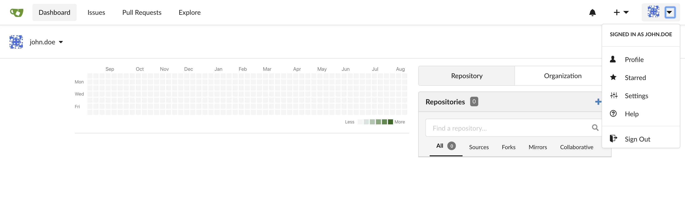
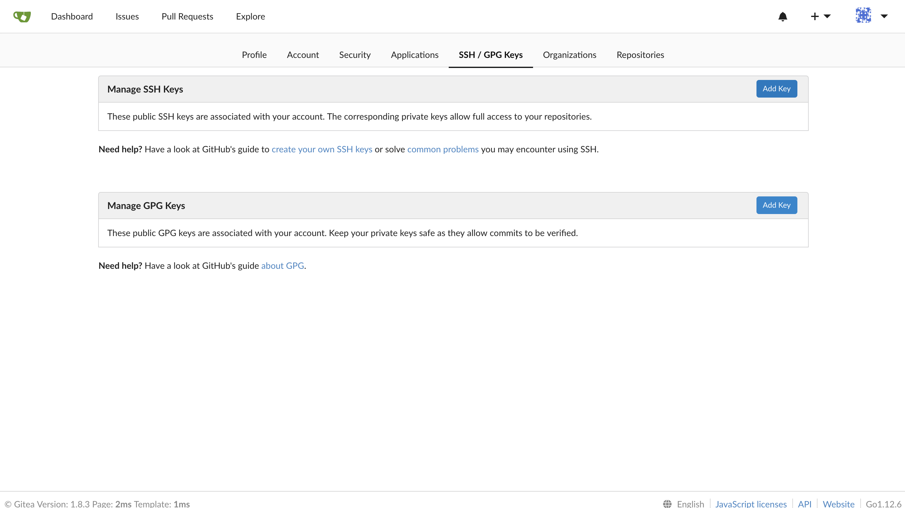
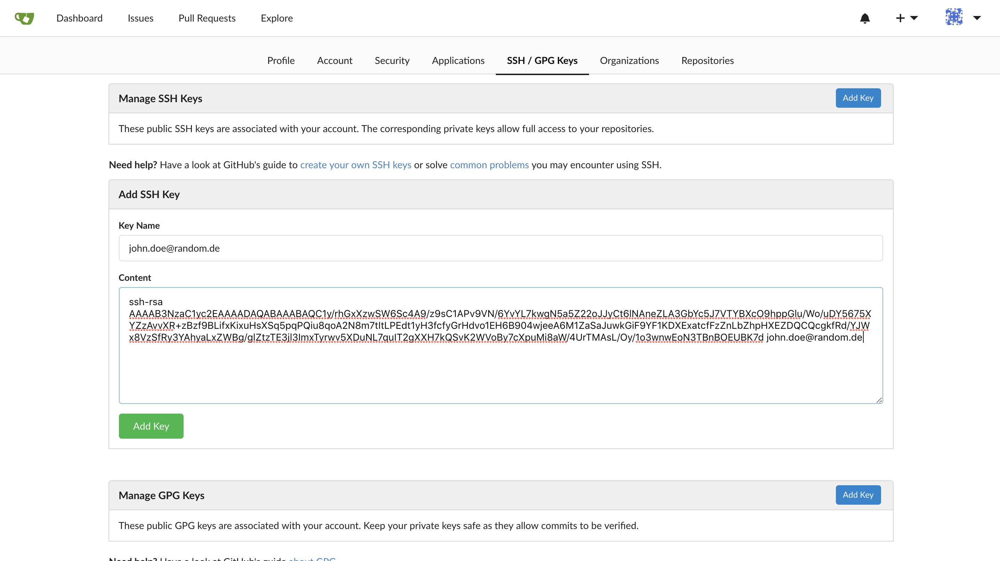

# Git multi user

## Abstract

We want to have various git users and push to multi repositories.
For the scenario there are 2 different gitea server enabled.

## Setup environment

Run the following command for the setup
`~/assets/setup_env.sh`{{execute}}

- [Gitea 1](https://[[HOST_SUBDOMAIN]]-30001-[[KATACODA_HOST]].environments.katacoda.com/)
  - username: john.doe
  - email: john.doe@random.de
  - password: secret
- [Gitea 2](https://[[HOST_SUBDOMAIN]]-30002-[[KATACODA_HOST]].environments.katacoda.com/)
  - username: jane.doe
  - email: jane.doe@random.de
  - password: secret

Login with both users.

## Setup ssh keys

To access our repository we need to create 2 ssh key pairs

`ssh-keygen -t rsa -N "" -C "john.doe@random.de" -f '/root/.ssh/id_rsa_john_doe'`{{execute}}
`ssh-keygen -t rsa -N "" -C "jane.doe@random.de" -f '/root/.ssh/id_rsa_jane_doe'`{{execute}}

Add the public key content to related gitea account
`cat ~/.ssh/id_rsa_john_doe.pub`{{execute}}
`cat ~/.ssh/id_rsa_jane_doe.pub`{{execute}}

See the step by step instructions





Also we need to configure which user to use for which git server.
`touch ~/.ssh/config`{{execute}}
Copy

```ssh
# gitea-1 john.doe
Host localhost:22001
  HostName localhost
  Port: 22001
  User git
  IdentityFile ~/.ssh/id_rsa_john_doe

# gitea-2 jane.doe
Host localhost:22002
  HostName localhost
  Port: 22002
  User git
  IdentityFile ~/.ssh/id_rsa_jane_doe
```

to **~/.ssh/config**

Now we are set to test the settings.

We want to clone the repositories

`mkdir git`{{execute}}
`cd git`{{execute}}
`git clone ssh://git@localhost:22001/john.doe/john-repo.git`{{execute}}
`git clone ssh://git@localhost:22002/jane.doe/jane-repo.git`{{execute}}

Now make a change to both repositories, commit and push.
As you can see when that the right user is auto selected :rocket:
