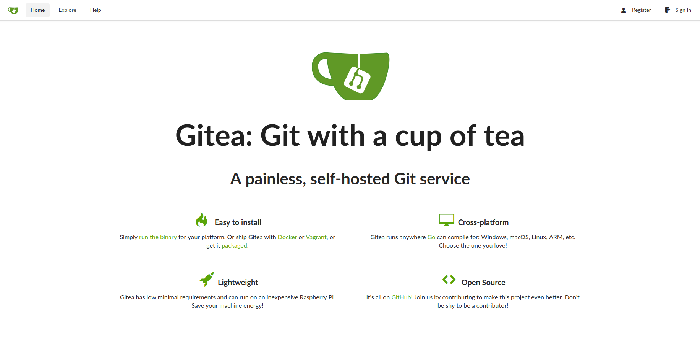
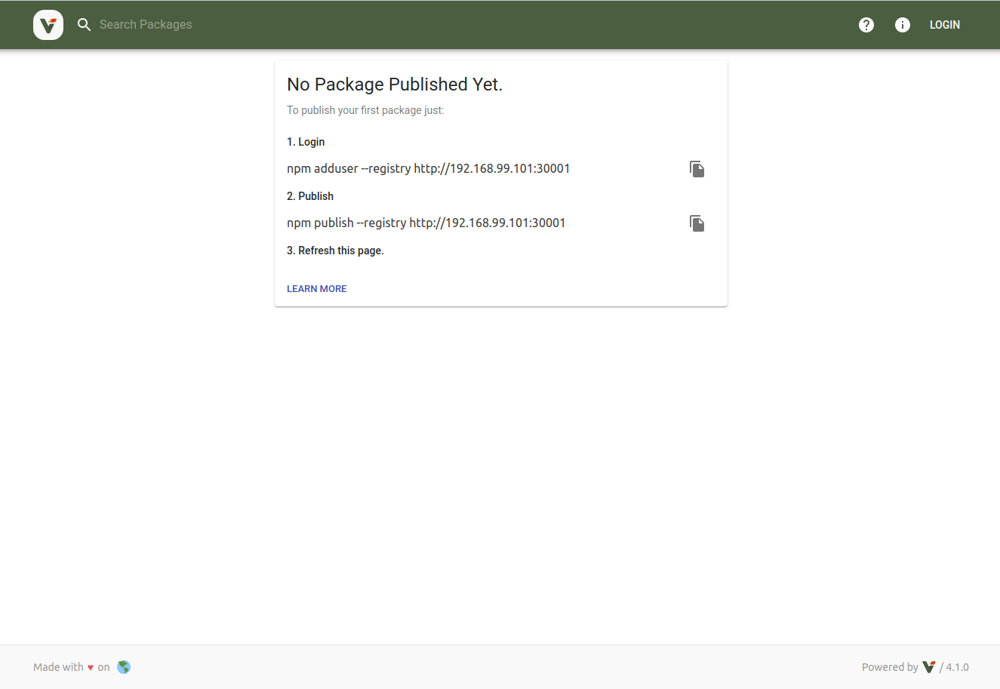

# OPS setup

## Abstract

We need to prepare the infrastructure.
We use

- [gitea](https://gitea.io/en-us/)
- [verdaccio](https://github.com/verdaccio/verdaccio)

in a kubernetes environment. The services are already up and running.

## Setup

### Gitea

TODO:(anau) add OPS stuff setup documentation

### Verdaccio

TODO:(anau) add OPS stuff setup documentation

