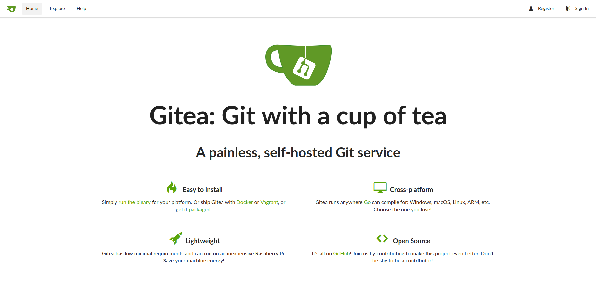
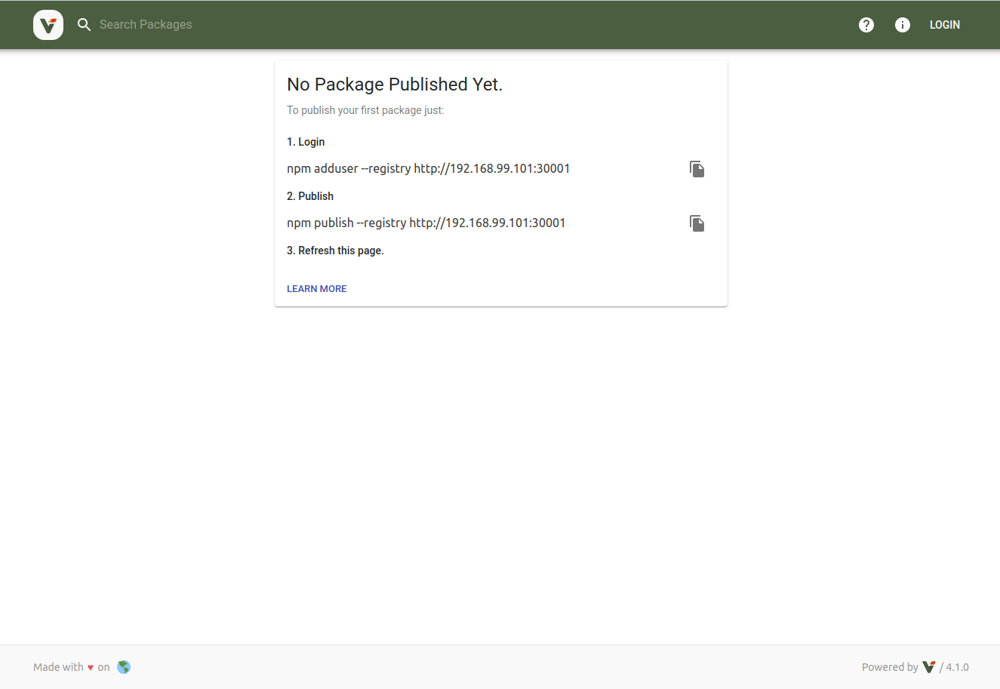

# OPS setup

## Abstract

We need to prepare the infrastructure.
We use

- [gitea](https://gitea.io/en-us/)
- [verdaccio](https://github.com/verdaccio/verdaccio)

in a `docker-compose` environment.

## Setup

### docker-compose

Setup environment

`./assets/setup_env.sh`{{execute}}

### Gitea

To access [Gitea](https://[[HOST_SUBDOMAIN]]-30002-[[KATACODA_HOST]].environments.katacoda.com/)
click on the **gitea** tab in the console.

TODO:(anau) add OPS stuff setup documentation

### Verdaccio

To access [Verdaccio](https://[[HOST_SUBDOMAIN]]-30001-[[KATACODA_HOST]].environments.katacoda.com/)
click on the **verdaccio** tab in the console.

TODO:(anau) add OPS stuff setup documentation

